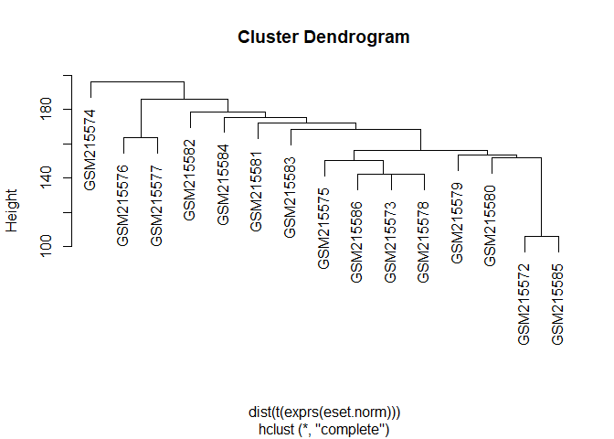

protocolo exemplificando o trabalho com o GEOquery e limma
================

<http://bridgeslab.sph.umich.edu/protocols/index.php/Using_Bioconductor_To_Analyse_Microarray_Data>

``` r
suppressPackageStartupMessages(library(Biobase))
suppressPackageStartupMessages(library(GEOquery))

gds <- getGEO("GDS2946")  #load GDS162 dataset
```

    ## File stored at:

    ## Parsed with column specification:
    ## cols(
    ##   ID_REF = col_character(),
    ##   IDENTIFIER = col_character(),
    ##   GSM215572 = col_double(),
    ##   GSM215573 = col_double(),
    ##   GSM215574 = col_double(),
    ##   GSM215575 = col_double(),
    ##   GSM215576 = col_double(),
    ##   GSM215577 = col_double(),
    ##   GSM215578 = col_double(),
    ##   GSM215579 = col_double(),
    ##   GSM215580 = col_double(),
    ##   GSM215581 = col_double(),
    ##   GSM215582 = col_double(),
    ##   GSM215583 = col_double(),
    ##   GSM215584 = col_double(),
    ##   GSM215585 = col_double(),
    ##   GSM215586 = col_double()
    ## )

``` r
Meta(gds)  #show extracted meta data
```

    ## $channel_count
    ## [1] "1"
    ## 
    ## $dataset_id
    ## [1] "GDS2946" "GDS2946"
    ## 
    ## $description
    ## [1] "Comparison of epididymal fat tissues from diet-induced obese (DIO) and lean animals. DIO animals were fed a high fat, high sucrose diet to induce obesity."
    ## [2] "diet-induced obese"                                                                                                                                        
    ## [3] "control"                                                                                                                                                   
    ## 
    ## $email
    ## [1] "geo@ncbi.nlm.nih.gov"
    ## 
    ## $feature_count
    ## [1] "31099"
    ## 
    ## $institute
    ## [1] "NCBI NLM NIH"
    ## 
    ## $name
    ## [1] "Gene Expression Omnibus (GEO)"
    ## 
    ## $order
    ## [1] "none"
    ## 
    ## $platform
    ## [1] "GPL1355"
    ## 
    ## $platform_organism
    ## [1] "Rattus norvegicus"
    ## 
    ## $platform_technology_type
    ## [1] "in situ oligonucleotide"
    ## 
    ## $pubmed_id
    ## [1] "18239588"
    ## 
    ## $ref
    ## [1] "Nucleic Acids Res. 2005 Jan 1;33 Database Issue:D562-6"
    ## 
    ## $reference_series
    ## [1] "GSE8700"
    ## 
    ## $sample_count
    ## [1] "15"
    ## 
    ## $sample_id
    ## [1] "GSM215572,GSM215573,GSM215574,GSM215575,GSM215576,GSM215577,GSM215578"          
    ## [2] "GSM215579,GSM215580,GSM215581,GSM215582,GSM215583,GSM215584,GSM215585,GSM215586"
    ## 
    ## $sample_organism
    ## [1] "Rattus norvegicus"
    ## 
    ## $sample_type
    ## [1] "RNA"
    ## 
    ## $title
    ## [1] "Diet-induced obesity model: epididymal fat tissue"
    ## 
    ## $type
    ## [1] "Expression profiling by array" "individual"                   
    ## [3] "individual"                   
    ## 
    ## $update_date
    ## [1] "Feb 25 2013"
    ## 
    ## $value_type
    ## [1] "count"
    ## 
    ## $web_link
    ## [1] "http://www.ncbi.nlm.nih.gov/geo"

``` r
# table(gds)[1:10,]  #show first ten rows of dataset
eset <- GDS2eSet(gds, do.log=TRUE)  #convert to expression set, by default obtains annotation (GPL) data with log2 transformation
```

    ## File stored at:

    ## C:\Users\Joao\AppData\Local\Temp\RtmpWGYyZu/GPL1355.annot.gz

    ## Warning: 57 parsing failures.
    ##   row             col           expected    actual         file
    ## 31043 Platform_SPOTID 1/0/T/F/TRUE/FALSE --Control literal data
    ## 31044 Platform_SPOTID 1/0/T/F/TRUE/FALSE --Control literal data
    ## 31045 Platform_SPOTID 1/0/T/F/TRUE/FALSE --Control literal data
    ## 31046 Platform_SPOTID 1/0/T/F/TRUE/FALSE --Control literal data
    ## 31047 Platform_SPOTID 1/0/T/F/TRUE/FALSE --Control literal data
    ## ..... ............... .................. ......... ............
    ## See problems(...) for more details.

``` r
pData(eset)  #phenotype data
```

    ##              sample         individual
    ## GSM215572 GSM215572 diet-induced obese
    ## GSM215573 GSM215573 diet-induced obese
    ## GSM215574 GSM215574 diet-induced obese
    ## GSM215575 GSM215575 diet-induced obese
    ## GSM215576 GSM215576 diet-induced obese
    ## GSM215577 GSM215577 diet-induced obese
    ## GSM215578 GSM215578 diet-induced obese
    ## GSM215579 GSM215579            control
    ## GSM215580 GSM215580            control
    ## GSM215581 GSM215581            control
    ## GSM215582 GSM215582            control
    ## GSM215583 GSM215583            control
    ## GSM215584 GSM215584            control
    ## GSM215585 GSM215585            control
    ## GSM215586 GSM215586            control
    ##                                                                   description
    ## GSM215572 Value for GSM215572: Diet Induced Obese rat C1; src: epididymal fat
    ## GSM215573 Value for GSM215573: Diet Induced Obese rat C2; src: epididymal fat
    ## GSM215574 Value for GSM215574: Diet Induced Obese rat C3; src: epididymal fat
    ## GSM215575 Value for GSM215575: Diet Induced Obese rat C5; src: epididymal fat
    ## GSM215576 Value for GSM215576: Diet Induced Obese rat C6; src: epididymal fat
    ## GSM215577 Value for GSM215577: Diet Induced Obese rat C7; src: epididymal fat
    ## GSM215578 Value for GSM215578: Diet Induced Obese rat C8; src: epididymal fat
    ## GSM215579       Value for GSM215579: control lean rat A1; src: epididymal fat
    ## GSM215580       Value for GSM215580: control lean rat A2; src: epididymal fat
    ## GSM215581       Value for GSM215581: control lean rat A3; src: epididymal fat
    ## GSM215582       Value for GSM215582: control lean rat A4; src: epididymal fat
    ## GSM215583       Value for GSM215583: control lean rat A5; src: epididymal fat
    ## GSM215584       Value for GSM215584: control lean rat A6; src: epididymal fat
    ## GSM215585       Value for GSM215585: control lean rat A7; src: epididymal fat
    ## GSM215586       Value for GSM215586: control lean rat A8; src: epididymal fat

``` r
sampleNames(eset)  #sample names (GSM)
```

    ##  [1] "GSM215572" "GSM215573" "GSM215574" "GSM215575" "GSM215576" "GSM215577"
    ##  [7] "GSM215578" "GSM215579" "GSM215580" "GSM215581" "GSM215582" "GSM215583"
    ## [13] "GSM215584" "GSM215585" "GSM215586"

``` r
library(limma)  #load limma package
```

    ## 
    ## Attaching package: 'limma'

    ## The following object is masked from 'package:BiocGenerics':
    ## 
    ##     plotMA

``` r
library(affyPLM)  #load affyPLM package
```

    ## Loading required package: affy

    ## Loading required package: gcrma

    ## Loading required package: preprocessCore

``` r
eset.norm <- normalize.ExpressionSet.quantiles(eset)  #normalize expression set by quantile method
pData(eset)  #to see phenotype annotation data
```

    ##              sample         individual
    ## GSM215572 GSM215572 diet-induced obese
    ## GSM215573 GSM215573 diet-induced obese
    ## GSM215574 GSM215574 diet-induced obese
    ## GSM215575 GSM215575 diet-induced obese
    ## GSM215576 GSM215576 diet-induced obese
    ## GSM215577 GSM215577 diet-induced obese
    ## GSM215578 GSM215578 diet-induced obese
    ## GSM215579 GSM215579            control
    ## GSM215580 GSM215580            control
    ## GSM215581 GSM215581            control
    ## GSM215582 GSM215582            control
    ## GSM215583 GSM215583            control
    ## GSM215584 GSM215584            control
    ## GSM215585 GSM215585            control
    ## GSM215586 GSM215586            control
    ##                                                                   description
    ## GSM215572 Value for GSM215572: Diet Induced Obese rat C1; src: epididymal fat
    ## GSM215573 Value for GSM215573: Diet Induced Obese rat C2; src: epididymal fat
    ## GSM215574 Value for GSM215574: Diet Induced Obese rat C3; src: epididymal fat
    ## GSM215575 Value for GSM215575: Diet Induced Obese rat C5; src: epididymal fat
    ## GSM215576 Value for GSM215576: Diet Induced Obese rat C6; src: epididymal fat
    ## GSM215577 Value for GSM215577: Diet Induced Obese rat C7; src: epididymal fat
    ## GSM215578 Value for GSM215578: Diet Induced Obese rat C8; src: epididymal fat
    ## GSM215579       Value for GSM215579: control lean rat A1; src: epididymal fat
    ## GSM215580       Value for GSM215580: control lean rat A2; src: epididymal fat
    ## GSM215581       Value for GSM215581: control lean rat A3; src: epididymal fat
    ## GSM215582       Value for GSM215582: control lean rat A4; src: epididymal fat
    ## GSM215583       Value for GSM215583: control lean rat A5; src: epididymal fat
    ## GSM215584       Value for GSM215584: control lean rat A6; src: epididymal fat
    ## GSM215585       Value for GSM215585: control lean rat A7; src: epididymal fat
    ## GSM215586       Value for GSM215586: control lean rat A8; src: epididymal fat

``` r
design=model.matrix(~ -1+factor(c(1,1,1,1,1,1,1,2,2,2,2,2,2,2,2)))  #set design matirx
colnames(design) <- c("obese","lean")  # give names to the treatment groups
design  #check the design matrix
```

    ##    obese lean
    ## 1      1    0
    ## 2      1    0
    ## 3      1    0
    ## 4      1    0
    ## 5      1    0
    ## 6      1    0
    ## 7      1    0
    ## 8      0    1
    ## 9      0    1
    ## 10     0    1
    ## 11     0    1
    ## 12     0    1
    ## 13     0    1
    ## 14     0    1
    ## 15     0    1
    ## attr(,"assign")
    ## [1] 1 1
    ## attr(,"contrasts")
    ## attr(,"contrasts")$`factor(c(1, 1, 1, 1, 1, 1, 1, 2, 2, 2, 2, 2, 2, 2, 2))`
    ## [1] "contr.treatment"

``` r
fit <- lmFit(eset.norm, design)  #Fit data to linear model
cont.matrix <- makeContrasts(Obese.vs.Lean=obese-lean, levels=design)
fit.cont <- contrasts.fit(fit, cont.matrix)
fit.cont.eb <- eBayes(fit.cont)  #Empirical Bayes
write.csv(fit.cont.eb, file="filename.csv")  #write to CSV file
```

``` r
hc <- hclust(dist(t(exprs(eset.norm))))
plot(hc)
```

<!-- -->
